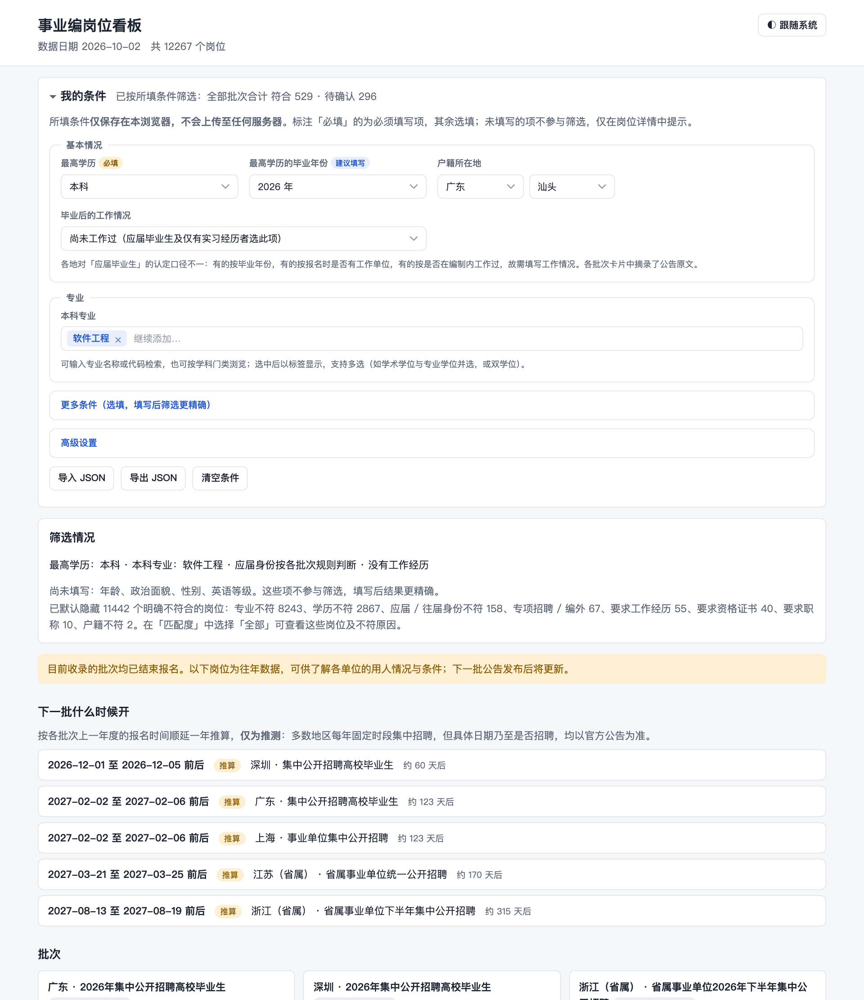

# 事业编岗位看板

汇总各地人社部门公布的**事业单位公开招聘岗位表**。在页面上设置个人条件（学历、专业、应届身份、工作经历、年龄等），自动筛出可报考的岗位，并将无法确定的标为「待确认」、注明需确认的事项。

**在线访问：<https://sigangluo.github.io/shiyebian-board/>**



*截图中的条件为虚构示例。*

**个人条件仅保存在使用者自己的浏览器（localStorage）中，筛选全部在本页完成，不会上传至任何服务器**，因此可部署为公开网站，由各访问者填写各自的条件。

## 能做什么

- **在页面上设置个人条件**：「我的条件」表单以选择为主，专业按教育部学科专业目录检索或按门类浏览（本科、研究生、大专），户籍选省、市，资格证书选常见项；修改任一项，结果即时刷新。条件存于浏览器，支持导入 / 导出 JSON。
- **兼顾应届毕业生**：「尚未工作过」是默认选项，仅有实习经历者同样选此项。
- **按个人条件筛选**：学历、专业（按专业代码比对，岗位写学科门类时，涵盖所选专业即视为符合）、应届 / 往届、工作经历、年龄、专项招聘、资格证书、职称、政治面貌。明确不符的岗位默认隐藏，并统计被筛除的原因。
- **三档判断**：**符合**（每项都能确认）/ **待确认**（至少一项拿不准，岗位详情里写着要确认什么）/ **不符**（默认隐藏）。原则是宁可多列入「待确认」，也不把可能可报的岗位判为「不符」。
- **应届认定按批次判断**：各地对「应届」的定义不同——上海看「是否落实**编制内**工作」（私企不算），江苏看「报名时是否有工作单位」，广东、深圳看「非在职 / 未落实工作单位」，浙江省属看毕业年份。每个批次都摘录了公告原文，并依其规则、结合所填的毕业年份和工作情况推断是否属于应届（已结束的批次假设下一批规则不变、届别顺延一年）。
- **报名状态和招聘日历**：报名中 / 即将开始 / 滚动招聘 / 已结束（往年参考）。已结束的批次按上一年度同期推算下一批的报名时间，页面设有「下一批什么时候开」（仅为推算，以官方公告为准）。
- **看详情、下载**：点开岗位可查看全部条件并跳转至官方公告；可导出当前筛选结果的 CSV，每个批次也可下载全部岗位的 CSV。在「匹配度」中选择「全部」，可查看被判为不符的岗位及原因。

## 开始使用

需要 Python 3.9+（运行测试另需 Node 18+）。

```bash
pip install -r requirements.txt

python3 scripts/update.py                # 抓取所有地区 + 生成看板数据
python3 scripts/serve.py                 # 打开 http://localhost:8000，在页面上填「我的条件」
```

`python3 scripts/update.py --list` 看当前接入了哪些地区和批次，`--only <地区>` 只重抓其中几个，`--build-only` 不抓取、只重新生成看板数据。

### 可选：用 profile.json 保存条件（只在本机）

不想每次在页面上填，或者想用脚本核对结果，可以复制 `profile.example.json` 为 `profile.json` 并填写（它被 `.gitignore` 忽略，不会进 git）。有这个文件时：

- `build.py` 会打印按它筛选的摘要（Python 版匹配规则，用来抽查数据、核对和页面结果一致）；
- 并生成一个仅限本机的 `site/data/profile.local.json`，页面在浏览器里还没有保存的条件时自动载入它（也可以点「载入本机 profile.json」）。

字段含义：

| 字段 | 说明 |
|---|---|
| `education` | 最高学历：大专 / 本科 / 硕士 / 博士 |
| `majors` | 各学历的专业：`codes` 填专业代码，`names` 填名称。**本科专业也建议填**，有些岗位只能以较低学历（本科）报考，要比对本科专业。`keywords`（出现就算对口，如「计算机」「工学」）和 `related`（出现算待确认，如「信息」「电子」）用来匹配只写文字、没有专业代码的岗位表（上海、江苏） |
| `fresh` | `auto`（默认）按各批次公告的应届规则推断 / `yes` 一律按应届 / `no` 一律按往届 / `maybe` 一律待定 |
| `graduate_year` | 最高学历的毕业年份。`auto` 靠它判断各批次的应届规则 |
| `employed_now` | 报名时是否在职（有工作单位）。江苏等地要求「报名时无工作单位」 |
| `had_staff_job` | 是否在编制内（事业编、公务员）工作过。上海的应届定义是「未落实编制内工作」 |
| `had_any_job` | 毕业后是否有过任何工作（签过合同、缴过社保）。广东、深圳要求往届毕业生「未落实工作单位」 |
| `work_months` | 已有的正式工作月数 |
| `english` | `null` / `"CET4"` / `"CET6"`。要求四六级的岗位，没填只提示、不筛掉 |
| `residence` | 持有有效居住证的城市，如 `["上海"]`。上海对外省户籍的非应届人员要求居住证满一年 |
| `age` / `gender` / `politics` / `hukou` | 年龄、性别、政治面貌、户籍。**填了才会按它筛**，没填的项只在岗位详情里提醒 |
| `certs` | 已有的资格证书，如 `["教师资格"]` |
| `include_special` | 是否保留专项招聘岗位（退役军人、基层服务项目人员等） |

## 发布成公开网站

```bash
python3 scripts/publish.py               # 构建发布目录并检查，不推送
python3 scripts/publish.py --push        # 确认无误后强制推送到 gh-pages 分支
```

发布用 `build.py --public` 构建到临时目录：不读 `profile.json`、不生成 `profile.local.json`、不触及本机的 `site/data`，构建后还会检查发布目录里没有任何个人条件相关的文件。`gh-pages` 分支永远只有一个提交（旧数据不留在历史里）。需要先配置 `origin`，并在 GitHub Pages 设置里把 Source 设为 `gh-pages`。提交作者取本仓库的 `git config`，发布前请确认它是希望公开的身份（不要使用公司或内网邮箱）。

## 已接入的地区

| 地区 | 范围 | 说明 |
|---|---|---|
| 广东 | 全省集中招聘（含各市） | 岗位表 xlsx，每年 1–2 月 |
| 深圳 | 市属 + 各区 | 岗位表 xls，每年 11–12 月，比广东早 |
| 浙江（省属） | 省属事业单位 | 每年上半年、下半年各一批；**只接入了 2026 下半年**，上半年批次和各市、县的招聘还没接入 |
| 上海 | 全市集中招聘 | 每年 1–2 月；各单位全年自主发布的公告还没接入 |
| 江苏（省属） | 省属事业单位 | 每年 3 月；各市、县的招聘还没接入 |

**还没有接入**：北京（市属、各区分别发公告，岗位表格式不统一）、杭州 / 宁波 / 南京 / 苏州等各市的市属招聘、各地事业单位自主招聘。看板只覆盖上面这些，「没有」不等于「没有岗位」。

## 新增地区 / 新批次

- **新批次**（同一个地区明年的新公告）：在该地区 `fetch.py` 的 `META["batches"]` 里加一项，填公告页、岗位表地址、报名时间，以及公告里对「应届」的定义（`fresh_note` 摘录原文，`fresh_rule` 是给程序用的规则，选 `year / unemployed / no_staff_job / unplaced`，含义见 `scripts/lib/match.py` 的 `fresh_verdict`）。
- **新地区**：复制 `regions/_template`，实现 `fetch()`，不需要改其他任何文件。详细步骤见 [.claude/CLAUDE.md](.claude/CLAUDE.md#新增一个地区)。

## 项目结构

| 路径 | 作用 |
|---|---|
| `regions/<地区>/fetch.py` | 每个地区一个文件：META（元信息和批次）+ fetch()（下载并解析岗位表）。目录自动发现 |
| `scripts/` | `update.py` 抓取 + 合并入口；`build.py` 生成看板数据（不筛选）；`publish.py` 发布；`lib/` 是共用代码（统一岗位格式、文字解析、导出、Python 版匹配规则等） |
| `site/` | 静态看板，没有构建步骤：`assets/match.js` 是浏览器里的匹配规则，`assets/app.js` 是界面，`assets/picker.js` 是可搜索的选择控件，`assets/options.js` 是表单选项的逻辑，`assets/options.json` 是选项数据（专业目录、省市、证书） |
| `scripts/build_options.py` | 从教育部目录生成 `site/assets/options.json`（生成结果已提交，平时无需运行；目录更新时再运行，需要 poppler 的 `pdftotext`） |
| `profile.json` | 可选，个人条件（仅在本机，不进 git） |
| `raw/`、`data/`、`site/data/` | 下载的岗位表原件、解析后的 CSV、看板数据（都不进 git） |
| `tests/` | 单元测试：Python 一套，JS 一套；`tests/golden/cases.json` 是两边结果一致性的交叉测试样例（取自公开的岗位表，条件为虚构） |
| `.github/` | CI（每次提交运行两套测试）和 Issue 模板 |

## 测试

```bash
python3 -m unittest discover -s tests    # Python：文字解析、匹配规则、导出
node --test                              # JS：浏览器里的匹配规则（对 2940 条 Python 版算好的样例逐条核对）和表单选项逻辑（需要 Node 18+）
```

匹配规则有 Python（`scripts/lib/match.py`）和 JS（`site/assets/match.js`）两份，必须给出一模一样的结果。改了任何一边的规则后：
`python3 tests/make_golden.py` 重新生成交叉测试样例（需要 `data/` 里有抓取好的数据），再跑 `node --test`。

## 参与贡献

欢迎接入新的地区 / 批次、修正解析与匹配规则、补充测试。开发约定和流程见 [CONTRIBUTING.md](CONTRIBUTING.md)。发现岗位信息或匹配结果有误，请用 Issue 模板「岗位信息或匹配结果有误」反馈，并附上官方岗位表原文。

## 数据来源与版权

- **岗位信息**来自各地人社部门公开发布的招聘公告和岗位表（各批次的官方公告链接见页面），**版权归原发布单位所有**。本仓库不提交抓取的原始数据（`raw/`、`data/`、`site/data/` 均被 `.gitignore` 忽略），测试样例只含用于验证规则的少量岗位。
- **专业目录**：教育部《普通高等学校本科专业目录（2025年）》、国务院学位委员会与教育部《研究生教育学科专业目录（2022年）》、教育部《职业教育专业目录（2021年）》，用于表单中的专业选项（`site/assets/options.json`，由 `scripts/build_options.py` 生成）。
- **行政区划**：[china-division](https://github.com/airyland/china-division)（MIT 许可）整理的民政部行政区划，用于户籍和居住证的省市选项。
- **代码和文档**采用 [MIT 许可证](LICENSE)；该许可证不涵盖上述岗位信息和官方目录的版权。

## 数据说明与免责声明

- 岗位信息来自各地人社部门公开发布的招聘公告和岗位表，**版权归原发布单位所有**，本项目只做整理，仅供参考。**岗位是否仍在招、具体条件均以官方公告为准，报名前请务必核对原文**，并向招聘单位或咨询电话确认应届身份、专业是否符合。
- 「符合 / 待确认 / 不符」依据岗位表原文与所填条件自动判定，个别写法特殊的岗位可能存在误判。
- 应届身份依据各批次公告中的定义、结合所填情况推断，**并非官方认定**；公告未说明的情形（如入职后又离职是否属于「落实工作单位」）仅标为待确认，须向招聘单位咨询。
- 各地对「应届」「专业对照」的口径不同，规则不对等，具体见各批次摘录的公告原文。
